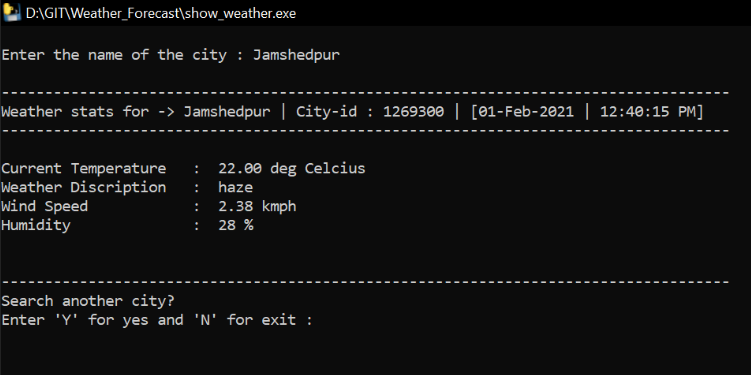

# Python project to display the weather forecast of a given city.

A simple project to show *current weather of any city* using **OpenWeatherMap API** in python

### Setup

Requests module is needed to send HTTP request 
Run the below command in terminal or cmd to install the **requests** module 
`pip install requests`  
If system fails to recognize **pip** command, it can be downloaded from <a href=https://bootstrap.pypa.io/get-pip.py>here</a> 
`python get-pip.py`  

### How to see the weather

Just double click on show_weather.py  
or open terminal in this project directory and give the command 
`python show_weather.py` for windows  
`python3 show_weather.py` for mac & linex kernel  

### How to see the database

Open the terminal in this project directory and give the command  
`python sequel.py` for windows  
`python3 sequel.py` for mac & linex kernel  